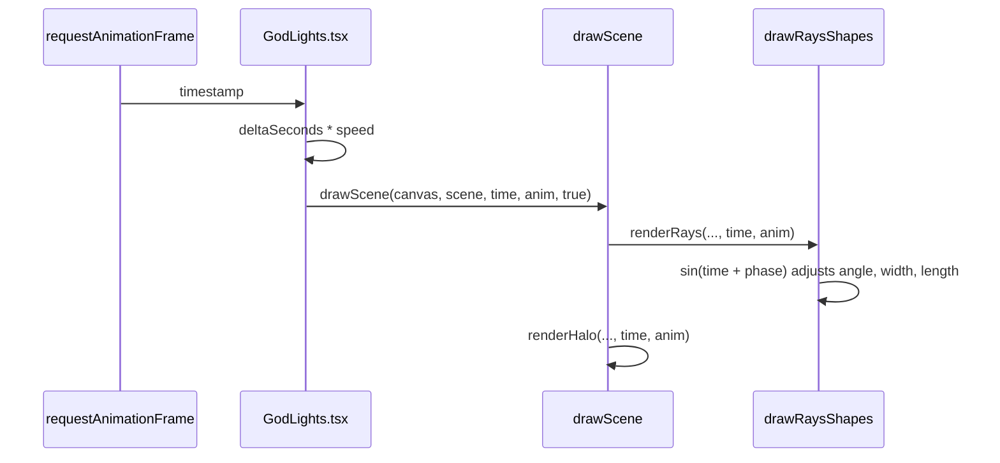

Animation in Godlights is intentionally separate from scene authoring. The scene describes what exists; `AnimParams` describes how much selected properties oscillate over time. That split keeps exports and saved scenes deterministic while still allowing rich motion in the React component or in your own `requestAnimationFrame` loop.

## What the Animation System Is

The animation model consists of:

- A monotonically increasing `time` value in seconds.
- Optional `AnimParams`.
- Per-layer math inside `renderHalo` and `drawRaysShapes`.

`AnimParams` is defined in [`packages/godlights/src/godrays.ts`](../../../../godlights/packages/godlights/src/godrays.ts):

```ts
export interface AnimParams {
  speed: number;
  angleAmp: number;
  lengthAmp: number;
  widthAmp: number;
  haloAmp: number;
}
```

## How It Relates to Other Concepts

- `SceneConfig` stays unchanged while animation changes frame to frame.
- `GodLights` is the default owner of the frame loop in React.
- `drawScene` is animation-aware because it accepts both `time` and `anim`.

## How It Works Internally

In `GodLights.tsx`, the animated branch stores the latest `scene` and `animParams` in refs, then starts a `requestAnimationFrame` loop. On each frame it computes delta time, scales it by `animParamsRef.current?.speed ?? 1`, and passes the accumulated time into `drawScene`.

Inside the engine:

- `renderHalo` uses `Math.sin(time * 0.4)` to pulse halo radius.
- `drawRaysShapes` uses a per-ray phase offset and several sine waves to animate angle, width, and length independently.
- The amplitude fields are normalized around `50`, so `anim.angleAmp / 50` produces a multiplier.



Because the RNG is reseeded from the layer’s `seed` for every frame, animation changes the motion of a stable beam layout instead of producing a flickering random redraw. That is the right kind of variation for a light effect.

## Basic Usage: Animated React Background

```tsx
import { GodLights, DEFAULT_ANIM_PARAMS } from "godlights";
import type { SceneConfig } from "godlights";

export function AnimatedBackground({ scene }: { scene: SceneConfig }) {
  return (
    <GodLights
      scene={scene}
      animate
      animParams={DEFAULT_ANIM_PARAMS}
      style={{ position: "absolute", inset: 0, width: "100%", height: "100%" }}
    />
  );
}
```

## Advanced Usage: Manual Canvas Loop

```ts
import { drawScene, type AnimParams, type SceneConfig } from "godlights";

const canvas = document.querySelector("canvas") as HTMLCanvasElement;
canvas.width = 1920;
canvas.height = 1080;

const anim: AnimParams = {
  speed: 0.9,
  angleAmp: 65,
  lengthAmp: 35,
  widthAmp: 10,
  haloAmp: 55,
};

let time = 0;
let lastTs: number | null = null;

function frame(ts: number, scene: SceneConfig) {
  if (lastTs !== null) {
    time += ((ts - lastTs) / 1000) * anim.speed;
  }
  lastTs = ts;
  drawScene(canvas, scene, time, anim);
  requestAnimationFrame((nextTs) => frame(nextTs, scene));
}

requestAnimationFrame((ts) => frame(ts, myScene));
```

This path is useful when React is not involved or when you want to integrate with another animation scheduler.

<Callout type="warn">There is no `opacityAmp` field. Both `GodLights.tsx` and `godrays.ts` explicitly document that the only valid animation keys are `speed`, `angleAmp`, `lengthAmp`, `widthAmp`, and `haloAmp`. If you generate configs from an LLM or a CMS, validate that field list before rendering.</Callout>

<Accordions>
  <Accordion title="Why animate with elapsed time instead of mutating layer values directly?">
    Godlights calculates animation from time plus stable scene inputs rather than mutating the scene object on every frame. That makes the render loop idempotent: given the same scene, same `AnimParams`, and same time value, you get the same output. It also keeps React integration simple because the component can store the latest scene in a ref and avoid rerendering the tree for every animation tick. The trade-off is that you cannot inspect a scene object and see the exact animated frame state without evaluating the renderer.
  </Accordion>
  <Accordion title="Why are amplitudes centered around 50?">
    The source turns each amplitude into a multiplier by dividing by `50`, which makes `50` feel like the balanced default rather than an extreme. Values below `50` dampen motion, while values above `50` exaggerate it. This keeps the default export `DEFAULT_ANIM_PARAMS` visually active without being chaotic. The trade-off is that amplitudes are not measured in literal pixels or degrees, so you tune them by feel rather than by a physical unit.
  </Accordion>
</Accordions>
