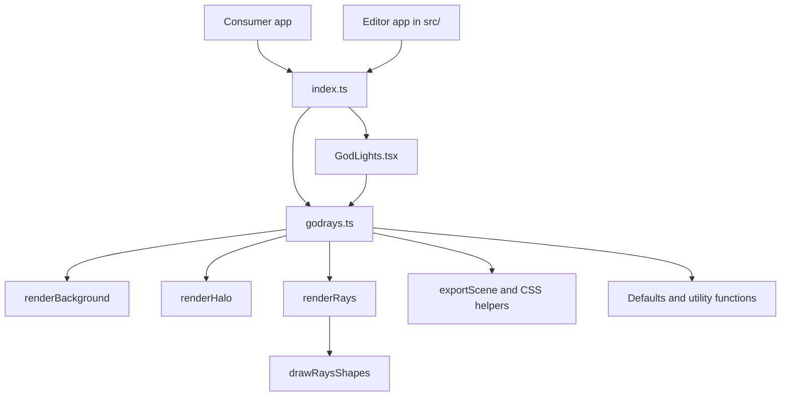
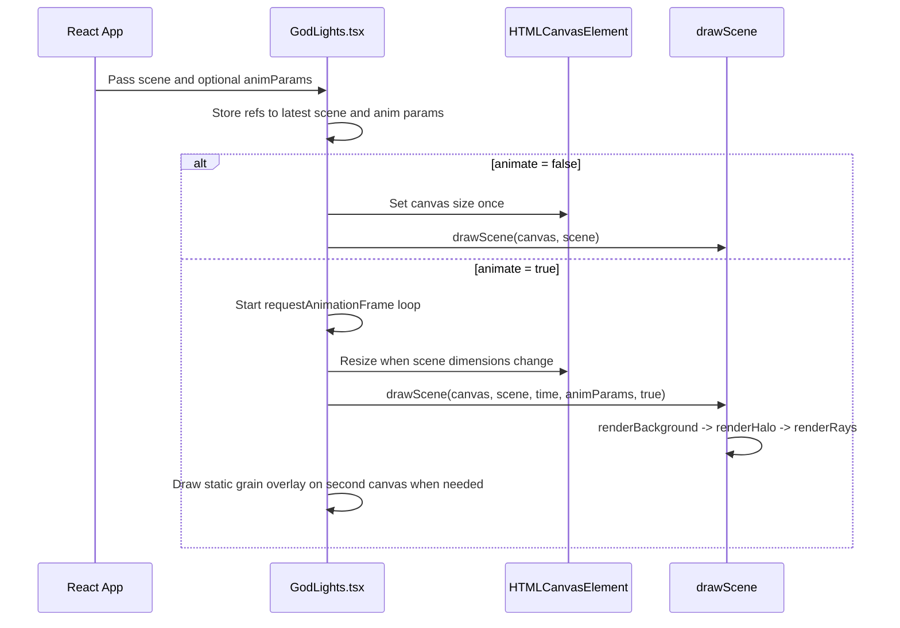

Godlights is intentionally small. The package entrypoint in [`packages/godlights/src/index.ts`](../../../../godlights/packages/godlights/src/index.ts) re-exports one React component from [`packages/godlights/src/GodLights.tsx`](../../../../godlights/packages/godlights/src/GodLights.tsx) and the rendering engine plus utilities from [`packages/godlights/src/godrays.ts`](../../../../godlights/packages/godlights/src/godrays.ts). The editor app in the repository root consumes that package, but the publishable API lives entirely in those three files.

## Module Map

## Key Design Decisions

### Layered scene data instead of a flat prop list

The API is `SceneConfig`, not a long parameter list. In [`packages/godlights/src/godrays.ts`](../../../../godlights/packages/godlights/src/godrays.ts), `SceneConfig` owns `width`, `height`, `noise`, `grainSize`, and an ordered `layers` array. That decision matters because rendering becomes a simple ordered pass in `drawScene`, and new layer types can be added without redesigning the component signature.

### A pure canvas engine underneath the React wrapper

`GodLights.tsx` does not implement rendering math. It only owns refs, effect timing, and an optional FPS badge. The actual draw call is always `drawScene(canvas, scene, time, anim, skipGrain)`. This separation keeps the renderer usable outside React, which is why the package can support direct canvas usage, PNG export, and CSS snippet generation from the same core logic.

### Deterministic randomness through seeded generation

Ray variation uses a seeded RNG in [`packages/godlights/src/godrays.ts`](../../../../godlights/packages/godlights/src/godrays.ts). `drawRaysShapes` creates a seeded RNG for every render, then uses it to vary width, length, and angle per ray. Because the same seed and same scene inputs yield the same beam distribution, editing one parameter does not randomize the entire composition unexpectedly.

### Grain handled differently in static and animated modes

`drawScene` can apply grain inline through `addGrain`, but `GodLights.tsx` deliberately skips that pass during animation and renders grain onto a second canvas only when noise-related inputs change. This is a performance choice visible in the `skipGrain` parameter and the dedicated `grainCanvasRef`. The moving light stays animated while the grain texture remains fixed, which avoids regenerating random image data every frame.

## Request and Render Lifecycle

## How the Pieces Fit Together

The public entrypoint re-exports everything from one import path, `godlights`, but the responsibilities are cleanly separated:

- `index.ts` is only a barrel file. It defines the package surface.
- `GodLights.tsx` is a React integration layer: refs, effects, `requestAnimationFrame`, FPS state, and wrapper markup.
- `godrays.ts` is the render engine and export toolbox: types, defaults, layer renderers, grain, export functions, CSS helpers, and legacy compatibility.

Within `godrays.ts`, rendering is a strict pipeline:

1. `drawScene` gets a 2D context and clears the canvas.
2. It loops through `scene.layers` in order.
3. `BackgroundLayer` is painted first by `renderBackground`.
4. `HaloLayer` uses `renderHalo`, which builds a radial gradient from the layer origin.
5. `RayLayer` uses `renderRays`, which may draw into an `OffscreenCanvas` first when blur is enabled.
6. `addGrain` optionally mutates the final pixel buffer after all layers are composited.

That ordering explains two of the most important user-facing rules:

- The background must be `layers[0]`, because that is the only layer that fully resets the frame.
- Blend modes on rays and halos are meaningful only relative to what earlier layers already painted.

## Why the API Feels Small

The component API has only five props because almost everything interesting is pushed into `SceneConfig`. That is a deliberate constraint. Instead of parallel prop trees for every beam option, the library treats the scene as content and the component as a renderer. The same scene object can be previewed in React, drawn directly to an offscreen canvas, exported to a blob, or converted to a CSS snippet without any transformation layer.

<Callout type="warn">The type surface is slightly ahead of the runtime in one place: the prose comments mention using `"multiply"` for light backgrounds, but `BlendMode` does not include `"multiply"` and `BLEND_MODES` does not export it. If you document or generate scenes programmatically, stay inside the typed union until the source changes.</Callout>

<Accordions>
  <Accordion title="Why use a second grain canvas in animated mode?">
    The source in `GodLights.tsx` separates grain from the main animation loop because noise generation is one of the few rendering steps that scales directly with pixel count. Recomputing image data for every frame would add work that does not improve the motion of the rays themselves. By rendering a fixed grain texture once and compositing it with `mixBlendMode: "overlay"`, the component preserves the visual texture while keeping the expensive per-frame work focused on beam geometry and gradients. The trade-off is that the grain does not shimmer over time, but that is usually acceptable for hero backgrounds and decorative scenes.
  </Accordion>
</Accordions>
