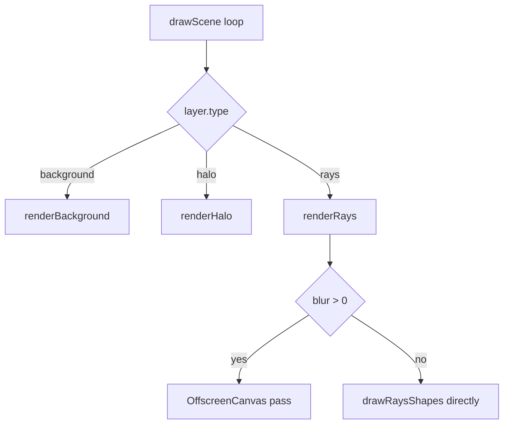

Godlights scenes are built from three layer types: `BackgroundLayer`, `HaloLayer`, and `RayLayer`. They are combined through the exported `Layer` union in [`packages/godlights/src/godrays.ts`](../../../../godlights/packages/godlights/src/godrays.ts), and `drawScene` renders them in array order.

## What the Layer System Is

The layer system gives the library a compositing model that behaves more like design software than a one-shot effect generator. A background establishes the base image, halos provide soft radial light sources, and ray layers create the actual beam geometry. Because all three share the same canvas and composite operations, you can stack them to build scenes that would be awkward to express as a flat options object.

## Relationship Between Layer Types

- `BackgroundLayer` clears and paints the base frame.
- `HaloLayer` is usually paired with nearby ray origins to suggest a source of light.
- `RayLayer` does the heavy visual lifting and responds most strongly to animation.

If you omit the halo layer, rays still render. If you omit rays, halos still render. If you omit or misplace the background layer, the whole frame lifecycle breaks because nothing resets the canvas correctly between draws.

## How It Works Internally

`drawScene` branches on `layer.type`:

- `"background"` calls `renderBackground`, which fills a solid or gradient backdrop.
- `"halo"` calls `renderHalo`, which creates a radial gradient centered at `originX` and `originY`.
- `"rays"` calls `renderRays`, which either draws directly to the main context or uses an `OffscreenCanvas` first when blur is nonzero.



`drawRaysShapes` is where the interesting math happens. It computes the origin in pixels, converts compass-style direction into canvas radians with `compassToCanvas`, uses the canvas diagonal to scale length, then generates one trapezoid per ray. Width, angle, and length variation all come from a seeded RNG plus optional animation amplitudes.

## Basic Usage: One Background, One Halo, One Ray Layer

```ts
import type { SceneConfig } from "godlights";

const scene: SceneConfig = {
  width: 1440,
  height: 900,
  noise: 8,
  grainSize: 1,
  layers: [
    {
      type: "background",
      bgType: "gradient",
      bgColor: "#0b1024",
      bgColor2: "#1a1340",
      bgGradientAngle: 180,
    },
    {
      type: "halo",
      originX: 50,
      originY: 0,
      color: "#ffd28a",
      intensity: 0.35,
      size: 0.3,
      blendMode: "lighter",
    },
    {
      type: "rays",
      direction: 180,
      spread: 80,
      originX: 50,
      originY: -10,
      rayCount: 18,
      rayWidth: 52,
      divergence: 1.5,
      rayLength: 1.1,
      opacity: 0.3,
      blendMode: "screen",
      colorStart: "#ffd28a",
      colorEnd: "#ffd28a",
      fadeToTransparent: true,
      blur: 12,
      randomnessWidth: 35,
      randomnessLength: 20,
      randomnessAngle: 8,
      seed: 1200,
    },
  ],
};
```

## Advanced Usage: Multiple Rays from Different Origins

```ts
import type { SceneConfig } from "godlights";

const scene: SceneConfig = {
  width: 1920,
  height: 1080,
  noise: 6,
  grainSize: 1,
  layers: [
    {
      type: "background",
      bgType: "solid",
      bgColor: "#000000",
      bgColor2: "#000000",
      bgGradientAngle: 180,
    },
    {
      type: "rays",
      direction: 155,
      spread: 55,
      originX: 12,
      originY: -20,
      rayCount: 22,
      rayWidth: 70,
      divergence: 1.7,
      rayLength: 0.75,
      opacity: 0.22,
      blendMode: "screen",
      colorStart: "#ffffff",
      colorEnd: "#ffffff",
      fadeToTransparent: true,
      blur: 16,
      randomnessWidth: 60,
      randomnessLength: 20,
      randomnessAngle: 12,
      seed: 11,
    },
    {
      type: "rays",
      direction: 205,
      spread: 18,
      originX: 95,
      originY: -24,
      rayCount: 10,
      rayWidth: 30,
      divergence: 2.6,
      rayLength: 0.55,
      opacity: 0.28,
      blendMode: "screen",
      colorStart: "#ffffff",
      colorEnd: "#ffffff",
      fadeToTransparent: true,
      blur: 16,
      randomnessWidth: 100,
      randomnessLength: 25,
      randomnessAngle: 0,
      seed: 22,
    },
  ],
};
```

This mirrors how the repository's preset data in [`src/lib/presets.ts`](../../../../godlights/src/lib/presets.ts) composes more cinematic scenes: a single background plus several coordinated halo and ray layers.

<Callout type="warn">The comments in the source repeatedly say light backgrounds should use `"multiply"`, but `BlendMode` currently allows only `"source-over"`, `"lighter"`, `"screen"`, `"overlay"`, `"soft-light"`, and `"hard-light"`. If you are staying type-safe, favor `"overlay"` or `"soft-light"` on light backgrounds until the exported union changes.</Callout>

<Accordions>
  <Accordion title="Why use `OffscreenCanvas` for blurred rays?">
    In `renderRays`, a nonzero blur value triggers an intermediate draw into `OffscreenCanvas`, followed by a blurred `drawImage` onto the main context. That keeps the blur operation focused on the ray geometry instead of blurring everything already painted behind it. It also preserves cleaner control over each layer's composite mode. The trade-off is reliance on `OffscreenCanvas` support in the runtime environment, so browser support matters if you target older platforms.
  </Accordion>
</Accordions>
