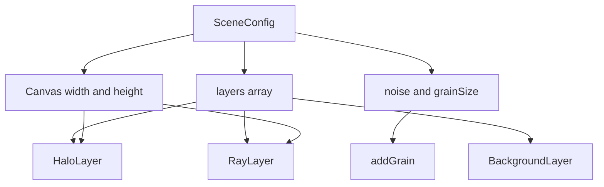

`SceneConfig` is the core abstraction in Godlights. It represents one complete scene: canvas dimensions, grain settings, and an ordered stack of layers. Every modern API entrypoint in the package depends on it, including `<GodLights>`, `drawScene`, `exportScene`, and `buildSceneCssSnippet`.

## What It Solves

Without a single scene object, rendering, exporting, sharing, and editing quickly drift apart. A component wants props, an export helper wants dimensions, and a visual editor wants serializable data. Godlights avoids that split by treating the scene as the one source of truth.

The interface is defined in [`packages/godlights/src/godrays.ts`](../../../../godlights/packages/godlights/src/godrays.ts):

```ts
export interface SceneConfig {
  width: number;
  height: number;
  noise: number;
  grainSize: number;
  layers: Layer[];
}
```

## How It Relates to Other Concepts

- `Layer` is the real payload of the scene. `SceneConfig` only defines the container and render order.
- `AnimParams` lives outside the scene so the same scene can be static or animated without mutation.

## Internal Flow

`drawScene(canvas, scene, time, anim, skipGrain)` is the function that proves `SceneConfig` is the center of the architecture. It reads `scene.layers` in order and dispatches each item by its `type` discriminator. Width and height are not merely metadata: `renderHalo` and `drawRaysShapes` convert percentage origins and diagonal-based sizes into pixel coordinates using the canvas dimensions.



The design choice to keep width and height inside the scene is important. Export helpers create temporary canvases sized from `scene.width` and `scene.height`, while the React component resizes its visible canvas to match the scene before drawing. That means the same scene object defines both how the artwork looks and what resolution it renders at.

## Basic Usage

```ts
import type { SceneConfig } from "godlights";

export const scene: SceneConfig = {
  width: 1920,
  height: 1080,
  noise: 8,
  grainSize: 1,
  layers: [
    {
      id: "background",
      type: "background",
      bgType: "gradient",
      bgColor: "#081122",
      bgColor2: "#02040a",
      bgGradientAngle: 180,
    },
  ],
};
```

This scene is valid but visually minimal. Once you add halo and ray layers after the background, `drawScene` will composite them front-to-back in that same array.

## Advanced Usage: Build Scenes from Defaults

```ts
import {
  DEFAULT_BACKGROUND_LAYER,
  DEFAULT_HALO_LAYER,
  DEFAULT_RAY_LAYER,
  type SceneConfig,
  type HaloLayer,
  type RayLayer,
} from "godlights";

const halo: HaloLayer = {
  ...DEFAULT_HALO_LAYER,
  id: "halo-hero",
  name: "Hero Halo",
  originX: 18,
  originY: 6,
  color: "#f8fafc",
  intensity: 0.22,
  size: 0.48,
};

const rays: RayLayer = {
  ...DEFAULT_RAY_LAYER,
  id: "rays-hero",
  name: "Hero Rays",
  originX: 16,
  originY: -10,
  direction: 165,
  spread: 75,
  opacity: 0.2,
  blur: 18,
};

export const scene: SceneConfig = {
  width: 1600,
  height: 900,
  noise: 10,
  grainSize: 2,
  layers: [
    { ...DEFAULT_BACKGROUND_LAYER, bgColor: "#050816", bgColor2: "#050816" },
    halo,
    rays,
  ],
};
```

This pattern is safer than hand-writing every field because the defaults already follow the engine’s expectations. It also makes future refactors easier when the package adds new required fields.

<Callout type="warn">Do not treat `DEFAULT_SCENE` as a mutable singleton. In `godrays.ts`, it is exported as a plain object with a nested `layers` array. Clone it before editing so two components do not accidentally share and mutate the same layer objects.</Callout>

<Accordions>
  <Accordion title="Why is `AnimParams` outside `SceneConfig`?">
    Godlights intentionally separates scene description from time-based behavior. A static export, a design-time preview, and an animated hero section can all share the same `SceneConfig` while varying only `AnimParams` or skipping animation entirely. That keeps saved scene data stable and serializable, especially for share URLs or editor persistence. The trade-off is that a complete runtime setup often involves two objects instead of one, but the separation keeps the content model much cleaner.
  </Accordion>
  <Accordion title="Why do width and height belong in the scene instead of the wrapper element?">
    The ray renderer uses the scene dimensions to convert percentages into pixels and to compute the canvas diagonal for `rayLength` and halo `size`. If width and height lived only in CSS, export helpers and offscreen rendering would need a second configuration path to know the real render resolution. Including them in `SceneConfig` ensures the scene is portable between on-screen rendering and exported assets. The trade-off is that responsive layouts often scale the already-rendered canvas, so you should choose scene dimensions for visual fidelity and let CSS handle display sizing.
  </Accordion>
</Accordions>
